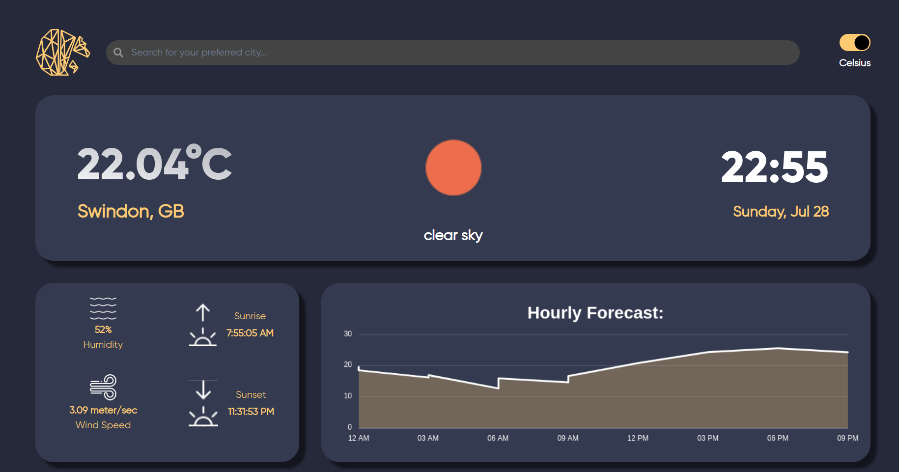

<br/>
<p align="center">
  <h3 align="center">Weather App</h3>

  <p align="center">
    This is a Weather App built using Vite that fetches weather information from the OpenWeatherMap API. The app displays the current weather based on the user's location, allows conversion between Celsius and Fahrenheit, and provides a search feature for city-specific weather information. It also shows details about sunrise and sunset, wind speed, temperature, and includes a graph to display the forecasted temperature for the upcoming hours.
    <br/>
    <br/>
    <a href="https://weather-app-lovat-delta-94.vercel.app/">View Demo</a>
    .
  </p>
</p>

## Table of Contents

- [Features](#features)
- [Demo](#demo)
- [Screenshots](#screenshots)
- [Installation](#installation)
  - [Prerequisites](#prerequisites)
  - [Installation Steps](#installation-steps)
- [Usage](#usage)
- [Built With](#built-with)

## Features

- **Current Location Weather**: Automatically fetches and displays weather information based on the user's current location.
- **Temperature Conversion**: Users can toggle between Celsius and Fahrenheit.
- **City Search**: Search for weather information by city name.
- **Detailed Weather Information**: Displays sunrise and sunset times, wind speed, and current temperature.
- **Temperature Forecast**: Graphical representation of the temperature forecast for the coming hours.

## Demo

Check out the live demo of the app [here](https://weather-app-lovat-delta-94.vercel.app/).

## Screenshots



## Installation

To get a local copy up and running follow these simple steps.

### Prerequisites

- Node.js (19.5.0)
- npm

### Installation Steps

1. Clone the Repository

You can clone the repository using either HTTPS or SSH:

**HTTPS:**
```sh
git clone https://github.com/Kiana8181/Weather-App.git
```

**SSH:**
```sh
git clone git@github.com:Kiana8181/Weather-App.git
```

<br/>
<br/>

2. Navigate to the project directory:

```sh
cd WeatherApp/
```

<br/>
<br/>

3. Install dependencies:

```sh
npm install
```

<br/>
<br/>

4. Start the development server:

```sh
npm run dev
```
<br/>
<br/>

5. Open your web browser and access the project at `http://localhost:5173`.

That's it! You now have the KWallet Frontend running locally on your machine.

<br/>
<br/>

6. Builds the app for production(optional):

 ```sh
npm run build

```

## Usage

1. **View Current Location Weather:**
   - Allow the app to access your location.
   - The app will automatically display the current weather information for your location.

2. **Search by City:**
   - Enter the city name in the search bar and press enter.
   - The app will fetch and display the weather information for the entered city.

3. **Convert Temperature:**
   - Click on the temperature unit (°C/°F) to toggle between Celsius and Fahrenheit.

4. **View Detailed Weather Information:**
   - The app displays additional weather details such as sunrise and sunset times, wind speed, and temperature.

5. **Temperature Forecast Graph:**
   - View the forecasted temperature for the coming hours in a graphical format.

## Built With

- [Vite](https://vitejs.dev/)
- [React](https://reactjs.org/)
- [OpenWeatherMap API](https://openweathermap.org/api)
